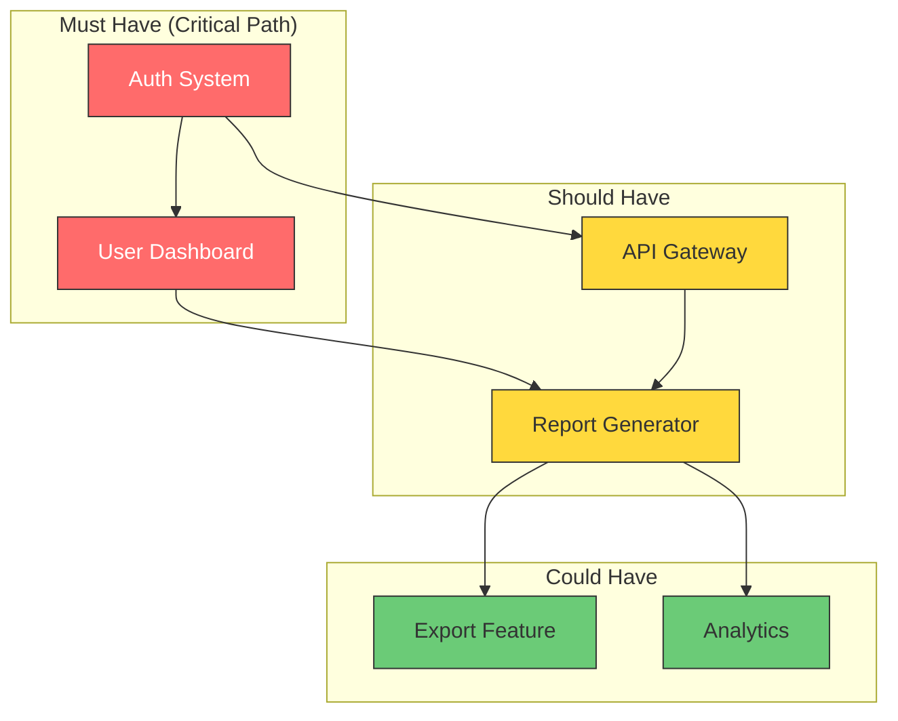
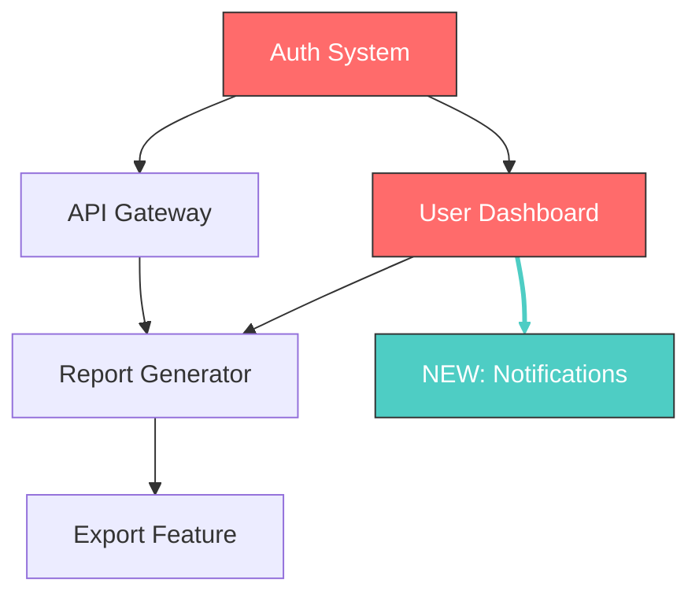

# Diff Summary & Dependency Graph Templates

**Supplemental templates for revisions and complex projects.**

---

## Diff Summary

**Include when updating an existing spec to a new version.**

```markdown
## Changes from v[X.Y] to v[X.Z]

**Change Date:** [Date]
**Author:** [Name]
**Reason for Revision:** [Brief explanation]

---

### Summary

| Category | Added | Modified | Removed |
|----------|-------|----------|---------|
| Features | [#] | [#] | [#] |
| Requirements | [#] | [#] | [#] |
| Metrics | [#] | [#] | [#] |
| Risks | [#] | [#] | [#] |

---

### Scope Changes

#### Added

| Item | Description | Priority | Rationale |
|------|-------------|----------|-----------|
| [Feature/Req] | [What it is] | Must/Should/Could | [Why added] |

#### Removed

| Item | Previous Description | Rationale |
|------|---------------------|-----------|
| [Feature/Req] | [What it was] | [Why removed] |

#### Modified

| Item | Previous | New | Rationale |
|------|----------|-----|-----------|
| [Feature/Req] | [Old version] | [New version] | [Why changed] |

---

### Metric Changes

| Metric | Previous Target | New Target | Reason |
|--------|-----------------|------------|--------|
| [Metric] | [Old] | [New] | [Why adjusted] |

---

### Risk Changes

#### New Risks Identified

| Risk | Likelihood | Impact | Mitigation |
|------|------------|--------|------------|
| [Risk] | H/M/L | H/M/L | [Plan] |

#### Risks Resolved/Removed

| Risk | Resolution |
|------|------------|
| [Risk] | [How it was addressed] |

#### Risk Reassessments

| Risk | Previous Assessment | New Assessment | Reason |
|------|---------------------|----------------|--------|
| [Risk] | [Old L/I] | [New L/I] | [Why changed] |

---

### Timeline Impact

| Milestone | Previous Date | New Date | Reason |
|-----------|---------------|----------|--------|
| [Milestone] | [Old] | [New] | [Cause of change] |

**Overall impact:** [Acceleration / No change / Delay of X days/weeks]

---

### Breaking Changes

| Change | Affected Users/Systems | Migration Required | Communication Plan |
|--------|------------------------|--------------------|--------------------|
| [Change] | [Who] | Yes/No | [How notifying] |

---

### Reviewer Notes

[Any context reviewers should know when evaluating this revision]
```

---

## Diff Summary Guidelines

### When to Include
- Any spec update beyond typo fixes
- Version increment from X.Y to X.Z or X.0 to Y.0
- Scope additions or reductions
- Timeline changes
- Stakeholder/ownership changes

### Best Practices
- **Be explicit about rationale** — future readers need to understand why, not just what
- **Quantify where possible** — "added 2 features" not "added features"
- **Flag breaking changes prominently** — these need extra attention
- **Connect to metrics** — if scope changed, how does it affect success targets?

---

## Dependency Graph

**Include for complex projects or when dependencies are non-obvious.**

```markdown
## Feature Dependencies



### Legend

| Color | Priority | Meaning |
|-------|----------|---------|
| 🔴 Red | Must-Have | Critical path — blocks launch if incomplete |
| 🟡 Yellow | Should-Have | High value but not blocking |
| 🟢 Green | Could-Have | Nice to have, cut if needed |

### Critical Path Analysis

**Critical path:** A → B → D → E
**Total estimated duration:** [X weeks]
**Bottleneck:** [Feature/dependency that gates the most]

### Dependency Details

| Feature | Blocked By | Blocks | Risk if Delayed |
|---------|------------|--------|-----------------|
| [Feature] | [Prerequisites] | [Dependents] | [Impact] |

### Parallelization Opportunities

| Track 1 | Track 2 | Sync Point |
|---------|---------|------------|
| [Features that can run parallel] | [Other features] | [When they must merge] |

### External Dependencies

| External | Feature Affected | Lead Time | Risk |
|----------|------------------|-----------|------|
| [Vendor/Team/API] | [What depends on it] | [How long to get] | H/M/L |
```

---

## Dependency Graph Guidelines

### When to Include
- Complex projects (≥5 features with dependencies)
- When stakeholders ask "what can we cut?"
- When timeline is tight and sequencing matters
- When multiple teams need to coordinate

### Mermaid Syntax Notes
- `graph TD` = top-down layout (good for dependency flow)
- `graph LR` = left-right (good for timeline/sequence)
- `-->` = dependency arrow (A --> B means A must complete before B)
- `subgraph` = grouping related items
- `style` = color coding

### For Non-Mermaid Formats

**Notion/Google Docs fallback:**
> "Dependency diagram available. Create visual using [mermaid.live](https://mermaid.live) with the code below, or see attached image."

Then include the mermaid code in a code block for copy-paste.

### Alternatives to Mermaid

If Mermaid isn't supported, use a simple table:

| Feature | Priority | Depends On | Blocks |
|---------|----------|------------|--------|
| Auth | Must | — | Dashboard, API |
| Dashboard | Must | Auth | Reports |
| API Gateway | Should | Auth | Reports |
| Reports | Should | Dashboard, API | Export |
| Export | Could | Reports | — |

---

## Combined Example: Diff + Graph

For major revisions to complex projects, include both:

1. **Diff Summary** — What changed and why
2. **Updated Dependency Graph** — New dependency structure
3. **Diff in Graph** — Highlight what's new/changed in the diagram

```markdown
### Dependency Changes



**Changes visualized:**
- 🆕 Cyan: New feature (Notifications)
- Thick cyan line: New dependency
```
